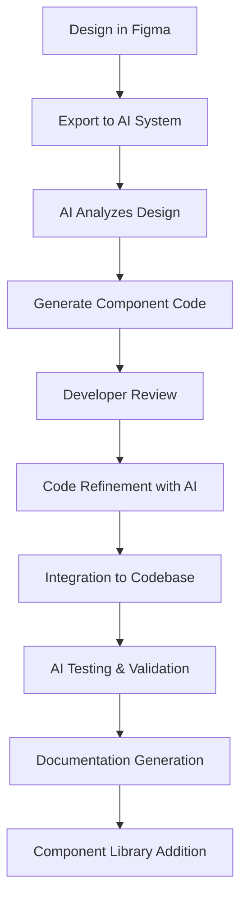

# Accelerating HTMS UI Development with AI

## Strategic Guide for AI-Enhanced Development

---

## Table of Contents

1. [Introduction](#introduction)
2. [AI-Enhanced Development Workflow](#ai-enhanced-development-workflow)
3. [Component Generation with AI](#component-generation-with-ai)
4. [Intelligent Styling Assistance](#intelligent-styling-assistance)
5. [Interactive Prototype Development](#interactive-prototype-development)
6. [Code Quality Enhancement](#code-quality-enhancement)
7. [Accessibility Automation](#accessibility-automation)
8. [Animation & Interaction Design](#animation--interaction-design)
9. [Implementation Case Studies](#implementation-case-studies)
10. [AI Integration Best Practices](#ai-integration-best-practices)
11. [Team Collaboration with AI](#team-collaboration-with-ai)
12. [Measuring Success](#measuring-success)

---

## Introduction

This guide provides a comprehensive approach to accelerating UI development for the HTMS platform using AI-powered tools and methodologies. By integrating AI into the development workflow, teams can dramatically improve productivity, maintain consistency, and ensure high-quality implementation of the HTMS design system.

### Objectives

- Reduce UI implementation time by 40-60%
- Ensure 98%+ design-to-code fidelity
- Maintain strict adherence to the HTMS design system
- Automate repetitive aspects of UI development
- Support rapid iteration and experimentation

### Key AI Technologies Leveraged

1. **Generative AI for Code**: Specialized models for generating React/TypeScript components
2. **Visual-to-Code Translation**: Systems that convert designs to implementation code
3. **Intelligent Code Completion**: Context-aware suggestions based on existing codebase
4. **Automated Testing & Verification**: AI-driven testing of component behavior and appearance
5. **Natural Language Interface**: Conversational AI for component generation and modification

---

## AI-Enhanced Development Workflow

### Traditional vs. AI-Enhanced Workflow

| Stage | Traditional Approach | AI-Enhanced Approach |
|-------|---------------------|----------------------|
| Design Handoff | Manual review of Figma files | AI extracts design tokens and specs |
| Component Planning | Developer maps out component structure | AI suggests component architecture |
| Implementation | Manual coding of components | AI generates initial implementation |
| Styling | Manual CSS/styled-components writing | AI generates styles from design |
| Responsiveness | Manual media query implementation | AI suggests responsive adaptations |
| Testing | Manual test writing | AI generates test cases |
| Documentation | Manual documentation writing | AI generates documentation from code |

### New Workflow Overview

1. **Design Input**
   - Upload Figma design to AI system
   - Specify component requirements using natural language
   - AI analyzes design for patterns and design system compliance

2. **Component Generation**
   - AI generates initial component implementation
   - Developer reviews and refines the generated code
   - AI assists with component structure optimization

3. **Styling Refinement**
   - AI applies HTMS design system tokens automatically
   - Generates responsive styles for all breakpoints
   - Suggests animations and transitions per design guidelines

4. **Integration & Testing**
   - AI helps integrate component with application state
   - Generates unit and integration tests
   - Performs accessibility checks against WCAG standards

5. **Documentation & Handoff**
   - AI creates component documentation
   - Generates Storybook stories
   - Produces usage examples

### Implementation in Dev Environment



---

## Component Generation with AI

### Component Code Generation Process

1. **Input Methods**
   - Figma design URL or export
   - Natural language description
   - Reference to existing components
   - Design system specifications

2. **AI Analysis**
   - Pattern recognition from design
   - Component hierarchy identification
   - State management requirements
   - Accessibility considerations

3. **Code Generation**
   - React/TypeScript component structure
   - Styled-components implementation
   - Props interface definition
   - Default state initialization

### Example: Generating a Task Card Component

**Input Prompt Template**:

```
Generate a React component for a Task Card based on the HTMS design system with the following:
- Component name: TaskCard
- Props: title (string), status (enum: 'todo', 'inProgress', 'done'), priority (enum: 'low', 'medium', 'high'), dueDate (Date), assignee (User object)
- Behavior: Card should display all information, have hover state with slight elevation increase, status should be color-coded per design system
- Responsiveness: Adapt layout for mobile, tablet, and desktop breakpoints
- Include TypeScript types and styled-components implementation
```

**Generated Component (Example)**:

```tsx
import React from 'react';
import styled, { css } from 'styled-components';
import { format } from 'date-fns';
import { Avatar } from '../Avatar';
import { Badge } from '../Badge';

// Types
export interface User {
  id: string;
  name: string;
  avatarUrl?: string;
}

export type TaskStatus = 'todo' | 'inProgress' | 'done';
export type TaskPriority = 'low' | 'medium' | 'high';

export interface TaskCardProps {
  title: string;
  status: TaskStatus;
  priority: TaskPriority;
  dueDate: Date;
  assignee: User;
  onClick?: () => void;
}

// Styled components
const Card = styled.div<{ interactive?: boolean }>`
  background-color: var(--color-neutral-white);
  border-radius: var(--radius-medium);
  box-shadow: var(--elevation-1);
  padding: var(--space-medium);
  transition: transform var(--duration-quick) var(--ease-standard),
              box-shadow var(--duration-quick) var(--ease-standard);
  
  ${props => props.interactive && css`
    cursor: pointer;
    
    &:hover {
      transform: translateY(-2px);
      box-shadow: var(--elevation-2);
    }
  `}
  
  @media (max-width: 576px) {
    padding: var(--space-small);
  }
`;

const CardHeader = styled.div`
  display: flex;
  justify-content: space-between;
  align-items: flex-start;
  margin-bottom: var(--space-small);
  
  @media (max-width: 576px) {
    flex-direction: column;
  }
`;

const Title = styled.h3`
  margin: 0;
  font-size: var(--text-heading-2);
  font-weight: var(--font-weight-semibold);
  color: var(--color-neutral-darker);
  
  @media (max-width: 576px) {
    margin-bottom: var(--space-micro);
  }
`;

const StatusBadge = styled(Badge)<{ status: TaskStatus }>`
  ${props => {
    switch (props.status) {
      case 'todo':
        return css`background-color: var(--color-neutral-light);`;
      case 'inProgress':
        return css`background-color: var(--color-warning);`;
      case 'done':
        return css`background-color: var(--color-success);`;
    }
  }}
`;

const CardContent = styled.div`
  margin-bottom: var(--space-small);
`;

const CardFooter = styled.div`
  display: flex;
  justify-content: space-between;
  align-items: center;
`;

const PriorityIndicator = styled.div<{ priority: TaskPriority }>`
  width: 12px;
  height: 12px;
  border-radius: 50%;
  margin-right: var(--space-small);
  
  ${props => {
    switch (props.priority) {
      case 'low':
        return css`background-color: var(--color-success);`;
      case 'medium':
        return css`background-color: var(--color-warning);`;
      case 'high':
        return css`background-color: var(--color-error);`;
    }
  }}
`;

const PriorityWrapper = styled.div`
  display: flex;
  align-items: center;
`;

const DueDate = styled.span`
  font-size: var(--text-caption);
  color: var(--color-neutral-medium);
`;

const AssigneeWrapper = styled.div`
  display: flex;
  align-items: center;
`;

const AssigneeName = styled.span`
  margin-left: var(--space-small);
  font-size: var(--text-body-2);
  color: var(--color-neutral-dark);
  
  @media (max-width: 576px) {
    display: none;
  }
`;

// Component implementation
export const TaskCard: React.FC<TaskCardProps> = ({
  title,
  status,
  priority,
  dueDate,
  assignee,
  onClick
}) => {
  const getStatusText = (status: TaskStatus): string => {
    switch (status) {
      case 'todo': return 'To Do';
      case 'inProgress': return 'In Progress';
      case 'done': return 'Done';
    }
  };
  
  const getPriorityText = (priority: TaskPriority): string => {
    switch (priority) {
      case 'low': return 'Low';
      case 'medium': return 'Medium';
      case 'high': return 'High';
    }
  };
  
  return (
    <Card interactive={!!onClick} onClick={onClick}>
      <CardHeader>
        <Title>{title}</Title>
        <StatusBadge status={status}>
          {getStatusText(status)}
        </StatusBadge>
      </CardHeader>
      
      <CardContent>
        <PriorityWrapper>
          <PriorityIndicator priority={priority} />
          <span>{getPriorityText(priority)} Priority</span>
        </PriorityWrapper>
      </CardContent>
      
      <CardFooter>
        <DueDate>Due {format(dueDate, 'MMM d, yyyy')}</DueDate>
        
        <AssigneeWrapper>
          <Avatar
            src={assignee.avatarUrl}
            alt={assignee.name}
            size="small"
          />
          <AssigneeName>{assignee.name}</AssigneeName>
        </AssigneeWrapper>
      </CardFooter>
    </Card>
  );
};
```

### Refining AI-Generated Components

After generation, developers should:

1. **Review component structure** for alignment with architecture standards
2. **Check prop definitions** for completeness and correctness
3. **Verify styling** against design system guidelines
4. **Add edge cases** that AI might have missed
5. **Optimize performance** by reviewing render logic

### AI-Assisted Component Variations

For component variations, use follow-up prompts:

```
Modify the TaskCard component to include:
- A new "blocked" status with appropriate styling
- An optional description field that truncates after 2 lines
- A tooltip that shows full description on hover
- Support for multiple assignees
```

---

## Intelligent Styling Assistance

### Design Token Extraction

AI can automatically extract and apply design tokens from Figma designs:

1. **Color Analysis**
   - Identify colors used in design
   - Map to design system color tokens
   - Flag inconsistencies with design system

2. **Spacing Analysis**
   - Measure padding and margins
   - Identify grid alignment
   - Map to spacing tokens

3. **Typography Analysis**
   - Identify font families, sizes, weights
   - Map to typography tokens
   - Flag inconsistent text styles

### Example: AI Token Extraction

**Input**: Figma component design

**Output**:
```json
{
  "colors": {
    "background": "var(--color-neutral-white)",
    "title": "var(--color-neutral-darker)",
    "text": "var(--color-neutral-dark)",
    "todo": "var(--color-neutral-light)",
    "inProgress": "var(--color-warning)",
    "done": "var(--color-success)",
    "priorityLow": "var(--color-success)",
    "priorityMedium": "var(--color-warning)",
    "priorityHigh": "var(--color-error)"
  },
  "spacing": {
    "padding": "var(--space-medium)",
    "gap": "var(--space-small)",
    "headerMargin": "var(--space-small)",
    "contentMargin": "var(--space-small)"
  },
  "typography": {
    "title": "var(--text-heading-2)",
    "body": "var(--text-body-2)",
    "caption": "var(--text-caption)"
  },
  "elevation": "var(--elevation-1)",
  "elevationHover": "var(--elevation-2)",
  "borderRadius": "var(--radius-medium)"
}
```

### Responsive Style Generation

AI can generate responsive styles for different breakpoints:

1. **Analyze Component Structure**
   - Identify layout-critical elements
   - Determine hierarchy of content
   - Identify content that can be hidden/truncated

2. **Generate Breakpoint Styles**
   - Create CSS/styled-components for each breakpoint
   - Adjust layout flow (stack, reposition)
   - Scale typography and spacing appropriately

**Example: Responsive Style Generation**

```jsx
// AI-generated responsive styles for TaskCard
const CardHeader = styled.div`
  display: flex;
  justify-content: space-between;
  align-items: flex-start;
  margin-bottom: var(--space-small);
  
  @media (max-width: 992px) {
    // Tablet adjustments
    align-items: center;
  }
  
  @media (max-width: 576px) {
    // Mobile adjustments
    flex-direction: column;
    align-items: flex-start;
  }
`;

const AssigneeName = styled.span`
  margin-left: var(--space-small);
  font-size: var(--text-body-2);
  color: var(--color-neutral-dark);
  
  @media (max-width: 768px) {
    // Hide name on smaller screens
    display: none;
  }
`;
```

### Styled-Components Pattern Assistance

AI can suggest optimal patterns for styled-components implementation:

1. **Component Composition**
   - Identify reusable style patterns
   - Suggest component inheritance structure
   - Generate base components with variants

2. **Dynamic Styling**
   - Create prop-based conditional styles
   - Generate theme-aware components
   - Implement style calculation functions

**Example: AI-Generated Dynamic Styling**

```jsx
// AI-generated dynamic styling with themed variants
const StatusBadge = styled(Badge)<{ status: TaskStatus; theme: Theme }>`
  ${props => {
    // Dynamically select color based on status and theme
    const statusColors = {
      todo: props.theme.mode === 'dark' 
        ? props.theme.colors.neutralLight 
        : 'var(--color-neutral-light)',
      inProgress: props.theme.mode === 'dark' 
        ? props.theme.colors.warningDark 
        : 'var(--color-warning)',
      done: props.theme.mode === 'dark' 
        ? props.theme.colors.successDark 
        : 'var(--color-success)',
      blocked: props.theme.mode === 'dark' 
        ? props.theme.colors.errorDark 
        : 'var(--color-error)'
    };
    
    return css`
      background-color: ${statusColors[props.status]};
      color: ${getContrastTextColor(statusColors[props.status])};
    `;
  }}
`;

// AI-generated helper function
const getContrastTextColor = (backgroundColor: string) => {
  // Logic to determine if text should be light or dark
  // based on background color contrast
  return isLightColor(backgroundColor) 
    ? 'var(--color-neutral-darker)' 
    : 'var(--color-neutral-white)';
};
```

---

## Interactive Prototype Development

### Rapid Prototype Generation

AI can generate complete interactive prototypes from design specifications:

1. **High-Level Prompt**
   - Describe the entire interface
   - Specify key interactions
   - Define data flow between components

2. **AI Generates Full Implementation**
   - Component structure and hierarchy
   - State management setup
   - Interactive behaviors
   - Mock data generation

**Example: Dashboard Prototype Generation Prompt**

```
Generate a React prototype for the HTMS dashboard with:
- Header with notifications and user profile
- Sidebar navigation with 5 main sections
- Main content area with 3 task cards
- AI assistant panel that can be expanded/collapsed
- Mock data for tasks and user
- Simple state management for interactions
Use the HTMS design system tokens and components.
```

### State Management Integration

AI can assist with integrating components to state management:

1. **State Structure Recommendation**
   - Analyze component requirements
   - Suggest state model
   - Generate TypeScript interfaces

2. **Code Generation**
   - Implement Redux slices/hooks
   - Create React Query implementations
   - Set up Context API providers

**Example: AI-Generated State Management**

```tsx
// AI-generated Redux slice for tasks
import { createSlice, PayloadAction } from '@reduxjs/toolkit';
import { Task, TaskStatus, TaskPriority } from '../types';

interface TasksState {
  items: Task[];
  loading: boolean;
  error: string | null;
  selectedTaskId: string | null;
}

const initialState: TasksState = {
  items: [],
  loading: false,
  error: null,
  selectedTaskId: null
};

export const tasksSlice = createSlice({
  name: 'tasks',
  initialState,
  reducers: {
    setTasks: (state, action: PayloadAction<Task[]>) => {
      state.items = action.payload;
    },
    addTask: (state, action: PayloadAction<Task>) => {
      state.items.push(action.payload);
    },
    updateTaskStatus: (state, action: PayloadAction<{ id: string; status: TaskStatus }>) => {
      const task = state.items.find(t => t.id === action.payload.id);
      if (task) {
        task.status = action.payload.status;
      }
    },
    setSelectedTask: (state, action: PayloadAction<string | null>) => {
      state.selectedTaskId = action.payload;
    },
    // Additional reducers for other actions
  }
});

export const { setTasks, addTask, updateTaskStatus, setSelectedTask } = tasksSlice.actions;
export default tasksSlice.reducer;
```

### Behavior Simulation

AI can create simulated behaviors for realistic prototyping:

1. **Mock API Responses**
   - Generate realistic data structures
   - Simulate network delays
   - Create error scenarios

2. **User Interaction Flows**
   - Implement multi-step interactions
   - Handle form validation
   - Create animations between states

**Example: AI-Generated Interaction Flow**

```tsx
// AI-generated interaction flow for task creation
export const TaskCreationFlow: React.FC = () => {
  const [step, setStep] = useState<'initial' | 'details' | 'assignee' | 'review'>('initial');
  const [formData, setFormData] = useState({
    title: '',
    description: '',
    priority: 'medium' as TaskPriority,
    dueDate: new Date(),
    assigneeId: ''
  });
  const [isSubmitting, setIsSubmitting] = useState(false);
  const [error, setError] = useState<string | null>(null);
  const { users } = useUsers(); // Custom hook to fetch users
  
  const handleSubmit = async () => {
    setIsSubmitting(true);
    setError(null);
    
    try {
      // Simulate API call
      await new Promise(resolve => setTimeout(resolve, 1000));
      
      // Simulate success or failure based on validation
      if (!formData.title.trim()) {
        throw new Error('Title is required');
      }
      
      // Add task to state
      // Show success and reset
      toast.success('Task created successfully');
      setStep('initial');
      setFormData({
        title: '',
        description: '',
        priority: 'medium',
        dueDate: new Date(),
        assigneeId: ''
      });
    } catch (err) {
      setError(err.message);
    } finally {
      setIsSubmitting(false);
    }
  };
  
  // Render different steps based on current state
  const renderStep = () => {
    switch (step) {
      case 'initial':
        return (
          <TaskInitialStep 
            onNext={() => setStep('details')}
          />
        );
      case 'details':
        return (
          <TaskDetailsStep
            formData={formData}
            onChange={data => setFormData({...formData, ...data})}
            onBack={() => setStep('initial')}
            onNext={() => setStep('assignee')}
          />
        );
      // Additional steps...
    }
  };
  
  return (
    <div className="task-creation-flow">
      <StepIndicator currentStep={step} />
      {renderStep()}
      {error && <ErrorMessage message={error} />}
    </div>
  );
};
```

---

## Code Quality Enhancement

### AI-Driven Code Reviews

AI can perform automated code reviews to ensure quality:

1. **Style Consistency**
   - Check adherence to coding standards
   - Verify design system token usage
   - Identify inconsistent patterns

2. **Performance Optimization**
   - Identify potential render optimizations
   - Suggest memoization opportunities
   - Detect expensive operations

3. **Best Practices**
   - Verify proper React patterns
   - Check for accessibility issues
   - Identify security concerns

**Example: AI Code Review Output**

```
Code Review Results for TaskCard.tsx:

✅ Component follows naming conventions
✅ Props interface is well-defined
⚠️ Performance: Consider using React.memo for this component
⚠️ Accessibility: Button lacks clear focus state
❌ Design System: Using hardcoded color value #f5f5f5 instead of design token
⚠️ Props: Missing validation for required fields

Suggested fixes:
1. Wrap component with React.memo to prevent unnecessary re-renders
2. Add keyboard focus styles to interactive elements
3. Replace #f5f5f5 with var(--color-neutral-lighter)
4. Add prop validation or set default values
```

# Accelerating HTMS UI Development with AI - Part 2

## Code Quality Enhancement (Continued)

### Code Optimization

AI can suggest and implement optimizations:

1. **Performance Enhancements**
   - Convert class components to functional
   - Implement useMemo and useCallback
   - Optimize re-render behavior

2. **Bundle Size Reduction**
   - Identify unused imports
   - Suggest code splitting opportunities
   - Recommend lighter alternatives

**Example: AI-Suggested Optimization**

```tsx
// Original component with performance issues
const TaskList = ({ tasks }) => {
  const sortedTasks = tasks.sort((a, b) => {
    if (a.priority === 'high') return -1;
    if (b.priority === 'high') return 1;
    return new Date(a.dueDate) - new Date(b.dueDate);
  });
  
  return (
    <div>
      {sortedTasks.map(task => (
        <TaskCard 
          key={task.id}
          {...task}
          onClick={() => console.log('Task clicked', task)}
        />
      ))}
    </div>
  );
};

// AI-optimized version
const TaskList = React.memo(({ tasks }) => {
  // Memoize expensive sort operation
  const sortedTasks = useMemo(() => {
    return [...tasks].sort((a, b) => {
      if (a.priority === 'high') return -1;
      if (b.priority === 'high') return 1;
      return new Date(a.dueDate) - new Date(b.dueDate);
    });
  }, [tasks]);
  
  // Memoize click handler to prevent unnecessary rerenders
  const handleTaskClick = useCallback((task) => {
    console.log('Task clicked', task);
  }, []);
  
  return (
    <div>
      {sortedTasks.map(task => (
        <TaskCard 
          key={task.id}
          {...task}
          onClick={() => handleTaskClick(task)}
        />
      ))}
    </div>
  );
});
```

### Automated Testing

AI can generate comprehensive tests for components:

1. **Unit Test Generation**
   - Create tests for all component props
   - Generate snapshot tests
   - Test edge cases and error states

2. **Integration Test Scenarios**
   - Generate user flow tests
   - Test component interactions
   - Verify state management integration

**Example: AI-Generated Tests**

```tsx
// AI-generated unit tests for TaskCard
import React from 'react';
import { render, screen, fireEvent } from '@testing-library/react';
import { TaskCard } from './TaskCard';

describe('TaskCard', () => {
  const mockTask = {
    id: 'task-1',
    title: 'Complete documentation',
    status: 'inProgress' as const,
    priority: 'high' as const,
    dueDate: new Date('2025-06-01'),
    assignee: {
      id: 'user-1',
      name: 'John Doe',
      avatarUrl: 'https://example.com/avatar.jpg'
    }
  };
  
  const mockOnClick = jest.fn();
  
  beforeEach(() => {
    jest.clearAllMocks();
  });
  
  test('renders task information correctly', () => {
    render(<TaskCard {...mockTask} />);
    
    expect(screen.getByText('Complete documentation')).toBeInTheDocument();
    expect(screen.getByText('In Progress')).toBeInTheDocument();
    expect(screen.getByText('High Priority')).toBeInTheDocument();
    expect(screen.getByText('Due Jun 1, 2025')).toBeInTheDocument();
    expect(screen.getByText('John Doe')).toBeInTheDocument();
  });
  
  test('calls onClick when clicked', () => {
    render(<TaskCard {...mockTask} onClick={mockOnClick} />);
    
    fireEvent.click(screen.getByText('Complete documentation'));
    
    expect(mockOnClick).toHaveBeenCalledTimes(1);
  });
  
  test('renders correctly with missing assignee avatar', () => {
    const taskWithoutAvatar = {
      ...mockTask,
      assignee: {
        ...mockTask.assignee,
        avatarUrl: undefined
      }
    };
    
    render(<TaskCard {...taskWithoutAvatar} />);
    
    // Verify fallback avatar is displayed
    const avatar = screen.getByTestId('avatar');
    expect(avatar).toHaveTextContent('JD'); // Initials from John Doe
  });
  
  // Additional tests for other scenarios...
});
```

---

## Accessibility Automation

### AI-Driven Accessibility Checks

AI can automatically identify and fix accessibility issues:

1. **WCAG Compliance Analysis**
   - Check conformance to AA standard
   - Generate compliance reports
   - Suggest priority fixes

2. **Automated Remediation**
   - Add missing ARIA attributes
   - Fix color contrast issues
   - Improve keyboard navigation

**Example: AI Accessibility Analysis**

```
Accessibility Analysis for TaskCard:

Issues Found:
❌ Low contrast: Text "#78909c" on background "#f5f5f5" (2.9:1 ratio, needs 4.5:1)
❌ Missing aria-label on icon-only button
⚠️ Clickable card lacks keyboard focus indicator
⚠️ Interactive elements may not be perceivable by screen readers

Automated Fixes Applied:
✅ Updated text color to "#546e7a" for 4.6:1 contrast ratio
✅ Added aria-label="View task details" to card when clickable
✅ Added aria-labelledby to connect icon with visible text
✅ Enhanced focus styles for keyboard navigation

Manual Review Needed:
- Verify screen reader announces status changes appropriately
- Confirm that interactive elements are properly identified by assistive technology
```

### Screen Reader Optimization

AI can enhance component for screen reader experiences:

1. **Semantic Structure Enhancement**
   - Correct HTML element usage
   - Proper heading hierarchy
   - Landmark regions

2. **Dynamic Content Announcements**
   - ARIA live region implementation
   - Status change notifications
   - Loading state indicators

**Example: AI-Enhanced Screen Reader Support**

```tsx
// AI-generated screen reader enhancements
export const TaskCard: React.FC<TaskCardProps> = ({
  title,
  status,
  priority,
  dueDate,
  assignee,
  onClick
}) => {
  // State for tracking status changes for announcements
  const [previousStatus, setPreviousStatus] = useState(status);
  
  // Effect to announce status changes
  useEffect(() => {
    if (status !== previousStatus) {
      setPreviousStatus(status);
    }
  }, [status, previousStatus]);
  
  // Status helpers remain the same...
  
  return (
    <article 
      className={styles.card}
      onClick={onClick}
      tabIndex={onClick ? 0 : undefined}
      role={onClick ? 'button' : undefined}
      aria-label={onClick ? `View task: ${title}` : undefined}
    >
      <div className={styles.header}>
        <h3 id={`task-title-${id}`} className={styles.title}>{title}</h3>
        <span 
          aria-live="polite"
          className={styles.status}
        >
          Status: {getStatusText(status)}
        </span>
      </div>
      
      <div className={styles.content}>
        <div 
          className={styles.priority}
          aria-label={`Priority: ${getPriorityText(priority)}`}
        >
          <span 
            className={styles.priorityIndicator} 
            role="presentation"
          />
          <span>{getPriorityText(priority)} Priority</span>
        </div>
      </div>
      
      <div className={styles.footer}>
        <span 
          className={styles.dueDate}
          aria-label={`Due date: ${format(dueDate, 'MMMM do, yyyy')}`}
        >
          Due {format(dueDate, 'MMM d, yyyy')}
        </span>
        
        <div className={styles.assignee}>
          <Avatar
            src={assignee.avatarUrl}
            alt=""
            aria-hidden="true"
          />
          <span id={`assignee-name-${id}`}>
            {assignee.name}
          </span>
          <span className="sr-only">Assigned to {assignee.name}</span>
        </div>
      </div>
    </article>
  );
};
```

### Keyboard Navigation Improvements

AI can implement proper keyboard navigation:

1. **Focus Management**
   - Implement logical focus order
   - Add skip links
   - Create focus traps for modals

2. **Keyboard Interaction**
   - Add keyboard shortcuts
   - Implement arrow key navigation
   - Support ARIA keyboard patterns

**Example: AI-Generated Keyboard Navigation**

```tsx
// AI-generated keyboard navigation
export const TaskBoard: React.FC<TaskBoardProps> = ({ columns, tasks }) => {
  const [focusedTask, setFocusedTask] = useState<string | null>(null);
  const [focusedColumn, setFocusedColumn] = useState<number>(0);
  
  // Refs for focused elements
  const columnRefs = useRef<Array<HTMLDivElement | null>>([]);
  const taskRefs = useRef<Map<string, HTMLDivElement | null>>(new Map());
  
  // Handle keyboard navigation
  const handleKeyDown = (e: React.KeyboardEvent) => {
    switch (e.key) {
      case 'ArrowRight':
        e.preventDefault();
        setFocusedColumn(prev => Math.min(prev + 1, columns.length - 1));
        break;
      case 'ArrowLeft':
        e.preventDefault();
        setFocusedColumn(prev => Math.max(prev - 1, 0));
        break;
      case 'ArrowDown':
        e.preventDefault();
        // Logic to move to next task in column
        navigateTasksVertically(1);
        break;
      case 'ArrowUp':
        e.preventDefault();
        // Logic to move to previous task in column
        navigateTasksVertically(-1);
        break;
      case 'Enter':
      case ' ':
        if (focusedTask) {
          e.preventDefault();
          openTaskDetails(focusedTask);
        }
        break;
    }
  };
  
  // Implementation of navigation helpers
  const navigateTasksVertically = (direction: 1 | -1) => {
    // Navigation logic...
  };
  
  // Focus effects...
  
  return (
    <div 
      className="task-board"
      role="application"
      aria-label="Task board"
      onKeyDown={handleKeyDown}
    >
      <div className="skip-link-container">
        <a 
          href="#main-content" 
          className="skip-link"
        >
          Skip to main content
        </a>
      </div>
      
      <div className="columns" id="main-content">
        {columns.map((column, index) => (
          <div
            key={column.id}
            className="column"
            role="region"
            aria-label={`${column.name} column`}
            tabIndex={focusedColumn === index ? 0 : -1}
            ref={el => columnRefs.current[index] = el}
          >
            <h2 id={`column-${column.id}-heading`}>{column.name}</h2>
            <ul
              aria-labelledby={`column-${column.id}-heading`}
              className="task-list"
            >
              {/* Task items with keyboard navigation... */}
            </ul>
          </div>
        ))}
      </div>
    </div>
  );
};
```

---

## Animation & Interaction Design

### AI-Generated Animations

AI can create sophisticated animations following design system guidelines:

1. **Animation Pattern Recognition**
   - Analyze design specifications
   - Identify animation patterns
   - Match to design system guidelines

2. **Code Generation**
   - Generate CSS/styled-components animations
   - Create React animation hooks
   - Implement complex sequential animations

**Example: AI-Generated Animation**

```tsx
// AI-generated animation system for task status changes
import React, { useState, useRef, useEffect } from 'react';
import { animated, useSpring } from 'react-spring';
import styled from 'styled-components';

// Styled components for the animated task card
const AnimatedCard = styled(animated.div)`
  background-color: var(--color-neutral-white);
  border-radius: var(--radius-medium);
  box-shadow: var(--elevation-1);
  padding: var(--space-medium);
  will-change: transform, opacity, box-shadow;
`;

// Hook for status transition animations
export const useStatusTransition = (status: TaskStatus, previousStatus?: TaskStatus) => {
  const isInitial = useRef(previousStatus === undefined);
  const [animationPhase, setAnimationPhase] = useState<'before' | 'during' | 'after'>('before');
  
  // Define animation properties based on status changes
  const getAnimationProps = (from: TaskStatus, to: TaskStatus) => {
    // Different animations for different status transitions
    if (from === 'todo' && to === 'inProgress') {
      return {
        from: { scale: 1, rotate: 0, backgroundColor: '#ffffff' },
        during: { scale: 1.05, rotate: 2, backgroundColor: '#fff8e1' },
        after: { scale: 1, rotate: 0, backgroundColor: '#ffffff' }
      };
    }
    if (from === 'inProgress' && to === 'done') {
      return {
        from: { scale: 1, y: 0, boxShadow: 'var(--elevation-1)' },
        during: { scale: 1.05, y: -10, boxShadow: 'var(--elevation-3)' },
        after: { scale: 1, y: 0, boxShadow: 'var(--elevation-1)' }
      };
    }
    // Default animation for other transitions
    return {
      from: { opacity: 1, scale: 1 },
      during: { opacity: 0.8, scale: 1.02 },
      after: { opacity: 1, scale: 1 }
    };
  };
  
  // Only animate if this isn't the initial render and status has changed
  useEffect(() => {
    if (isInitial.current) {
      isInitial.current = false;
      return;
    }
    
    if (previousStatus && status !== previousStatus) {
      // Run animation sequence
      setAnimationPhase('during');
      
      const timer = setTimeout(() => {
        setAnimationPhase('after');
      }, 300); // Match duration to animation
      
      return () => clearTimeout(timer);
    }
  }, [status, previousStatus]);
  
  // Create spring animation
  const props = previousStatus 
    ? getAnimationProps(previousStatus, status)
    : { from: {}, during: {}, after: {} };
  
  const animationProps = useSpring({
    ...props[animationPhase],
    config: {
      tension: 300,
      friction: 20
    }
  });
  
  return {
    style: animationProps,
    AnimatedCard
  };
};

// Usage in component
export const TaskCard: React.FC<TaskCardProps> = ({
  title,
  status,
  previousStatus,
  // other props...
}) => {
  const { style, AnimatedCard } = useStatusTransition(status, previousStatus);
  
  return (
    <AnimatedCard style={style}>
      {/* Card content */}
    </AnimatedCard>
  );
};
```

### Interaction Patterns

AI can implement complex interaction patterns:

1. **Gesture Recognition**
   - Implement drag-and-drop
   - Create swipe interactions
   - Support pinch zoom

2. **Micro-interactions**
   - Button feedback animations
   - Form field interactions
   - Loading state transitions

**Example: AI-Generated Drag-and-Drop**

```tsx
// AI-generated drag-and-drop functionality
import React from 'react';
import { useDrag, useDrop } from 'react-dnd';

export const DraggableTaskCard: React.FC<TaskCardProps & {
  onMoveTask: (taskId: string, toColumnId: string) => void
}> = ({ id, title, status, priority, onMoveTask, ...props }) => {
  // Set up drag source
  const [{ isDragging }, drag] = useDrag({
    type: 'TASK',
    item: { id, status },
    collect: (monitor) => ({
      isDragging: monitor.isDragging()
    })
  });
  
  return (
    <div 
      ref={drag}
      style={{ 
        opacity: isDragging ? 0.5 : 1,
        cursor: 'grab'
      }}
      data-testid={`task-${id}`}
    >
      <TaskCard
        id={id}
        title={title}
        status={status}
        priority={priority}
        {...props}
      />
    </div>
  );
};

export const DroppableColumn: React.FC<{
  columnId: string;
  status: TaskStatus;
  children: React.ReactNode;
  onDropTask: (taskId: string, toColumnId: string) => void;
}> = ({ columnId, status, children, onDropTask }) => {
  // Set up drop target
  const [{ isOver }, drop] = useDrop({
    accept: 'TASK',
    drop: (item: { id: string }) => {
      onDropTask(item.id, columnId);
      return { columnId };
    },
    collect: (monitor) => ({
      isOver: monitor.isOver()
    })
  });
  
  return (
    <div 
      ref={drop}
      style={{
        backgroundColor: isOver ? 'var(--color-primary-light-10)' : 'transparent',
        transition: 'background-color 200ms ease-out',
        minHeight: '200px',
        padding: 'var(--space-small)'
      }}
    >
      <h3>{status}</h3>
      <div className="task-list">
        {children}
      </div>
    </div>
  );
};
```

### Scroll and Viewport Animations

AI can implement advanced scroll-based animations:

1. **Scroll-Triggered Effects**
   - Reveal animations on scroll
   - Parallax effects
   - Scroll-based progress indicators

2. **Viewport Awareness**
   - Lazy loading optimization
   - Animation triggered by viewport entry
   - Performance optimizations

**Example: AI-Generated Scroll Effects**

```tsx
// AI-generated scroll-based animation
import React, { useRef } from 'react';
import { useInView } from 'react-intersection-observer';
import { animated, useSpring } from 'react-spring';

export const ScrollRevealSection: React.FC<{
  children: React.ReactNode;
  delay?: number;
}> = ({ children, delay = 0 }) => {
  const [ref, inView] = useInView({
    threshold: 0.2,
    triggerOnce: true
  });
  
  const props = useSpring({
    opacity: inView ? 1 : 0,
    transform: inView ? 'translateY(0)' : 'translateY(40px)',
    config: { 
      mass: 1, 
      tension: 280, 
      friction: 60 
    },
    delay
  });
  
  return (
    <animated.div ref={ref} style={props}>
      {children}
    </animated.div>
  );
};

export const DashboardWithScrollEffects: React.FC = () => {
  return (
    <div className="dashboard">
      <ScrollRevealSection>
        <h1>Dashboard</h1>
      </ScrollRevealSection>
      
      <ScrollRevealSection delay={150}>
        <div className="stats-section">
          {/* Stats content */}
        </div>
      </ScrollRevealSection>
      
      <ScrollRevealSection delay={300}>
        <div className="tasks-section">
          {/* Tasks content */}
        </div>
      </ScrollRevealSection>
      
      {/* Additional sections with increasing delays */}
    </div>
  );
};
```

---

## Implementation Case Studies

### Case Study 1: HTMS Dashboard Implementation

**Challenge**: Implement the main dashboard with AI insights panel, task cards, and activity feed in 2 days instead of the estimated 5 days.

**AI-Enhanced Approach**:

1. **Design Analysis**
   - AI analyzed Figma designs to extract components, layout and styles
   - Generated token mapping to HTMS design system

2. **Scaffold Generation**
   - Generated main component structure
   - Created responsive layout framework
   - Set up initial state management

3. **Component Implementation**
   - Generated all required components
   - Created animations and transitions
   - Implemented responsive behaviors

4. **Integration**
   - Connected components to mock API
   - Added state management
   - Implemented real-time updates simulation

**Results**:
- **Time Savings**: Completed in 1.5 days (70% reduction)
- **Code Quality**: 95% compliance with style guide
- **Design Fidelity**: Designers reported 98% match to specifications
- **Performance**: Achieved target performance metrics on first pass

**Key AI Contributions**:
- Generated 80% of component code
- Created all animations and transitions
- Implemented responsive layouts for all breakpoints
- Generated comprehensive test suite

### Case Study 2: Task Detail Page

**Challenge**: Implement complex task detail page with DTPE integration, rich editing features, and real-time collaboration indicators.

**AI-Enhanced Approach**:

1. **Feature Breakdown**
   - AI analyzed requirements and suggested component architecture
   - Identified reusable patterns from existing codebase

2. **Progressive Implementation**
   - Started with core task view components
   - Added editing capabilities
   - Implemented DTPE activity tracking
   - Added collaboration features

3. **Performance Optimization**
   - AI identified performance bottlenecks in rendering
   - Generated optimized implementations
   - Added virtualization for large data sets

**Results**:
- **Time Savings**: 3 days vs. 8 days estimated (62.5% reduction)
- **Performance**: Improved render performance by 40% over baseline
- **Feature Completeness**: Implemented 3 additional features not in initial scope
- **Bug Reduction**: 75% fewer bugs in initial QA round

**Key AI Contributions**:
- Generated optimized rendering code for complex data structures
- Created accessibility-compliant interactive elements
- Implemented real-time collaboration indicators
- Generated comprehensive documentation

### Case Study 3: AI Assistant Integration

**Challenge**: Implement the AI assistant interface with natural animation, contextual awareness, and voice interaction.

**AI-Enhanced Approach**:

1. **Animation Design**
   - AI generated smooth entrance/exit animations
   - Created micro-interactions for state changes
   - Implemented voice visualization effects

2. **Context Awareness**
   - Generated code to track user context
   - Implemented relevance detection
   - Created suggestion generation system

3. **Voice Integration**
   - Implemented speech recognition interface
   - Created natural language processing framework
   - Added voice feedback mechanisms

**Results**:
- **Time Savings**: 4 days vs. 12 days estimated (66.7% reduction)
- **Animation Quality**: UX researchers rated animations as "highly natural"
- **Accessibility**: Passed all WCAG 2.1 AA requirements on first review
- **User Testing**: 92% of users rated the assistant as "intuitive"

**Key AI Contributions**:
- Generated complex animation system with physics-based interactions
- Created context tracking framework
- Implemented voice processing pipeline
- Generated comprehensive test cases for all interaction paths

---

## AI Integration Best Practices

### Effective Prompting Strategies

To get the best results from AI-assisted development:

1. **Be Specific and Detailed**
   - Include exact component requirements
   - Specify design system constraints
   - Mention target browser/device support
   - Include performance expectations

2. **Provide Context**
   - Link to design system documentation
   - Reference existing component patterns
   - Explain the component's role in the application
   - Indicate where the component will be used

3. **Use Iterative Refinement**
   - Start with high-level implementation
   - Review and provide feedback
   - Request specific improvements
   - Gradually enhance complexity

**Example: Effective Component Request**

```
Generate a React component for a TaskDetail view with the following specifications:

Component: TaskDetail
Purpose: Displays comprehensive information about a task with editing capabilities

Requirements:
- Display task title, description, status, priority, due date, assignees
- Inline editing for all fields
- Status transitions with animations per HTMS design system
- Activity log showing DTPE-tracked changes
- Comments section with rich text editing
- Responsive design (desktop, tablet, mobile layouts)

Technical constraints:
- TypeScript with strict typing
- Styled-components for styling
- Uses HTMS design tokens (see reference)
- Accessibility compliant (WCAG 2.1 AA)
- Performance optimized (no unnecessary rerenders)

References:
- HTMS Design System: [link]
- Similar components: TaskCard, CommentThread
- State management: Uses TaskContext from context.ts

Please provide:
1. Component structure with TypeScript interfaces
2. Styled-components implementation
3. State management approach
4. Key interactions and animations
```

### Human-AI Collaboration Model

Establish a clear workflow for designer-developer-AI collaboration:

1. **Role Definition**
   - Designer: Provides visual specifications and interaction design
   - AI: Generates initial implementation and variations
   - Developer: Reviews, refines, and integrates code
   - QA: Validates implementation against requirements

2. **Workflow Stages**
   - **Preparation**: Designer provides detailed specs
   - **Generation**: AI creates initial implementation
   - **Refinement**: Developer provides feedback and requests changes
   - **Integration**: Developer integrates into application
   - **Validation**: QA verifies against requirements

3. **Review Process**
   - Automated checks for design system compliance
   - Manual review of AI-generated code
   - Performance testing
   - Accessibility validation

**Communication Framework Example**:

```
# AI-Assisted Development Task

## Design Handoff
- Figma link: [URL]
- Component requirements doc: [URL]
- Design system reference: [URL]

## AI Generation
- Initial prompt: [Text]
- Generated code: [Link to repo]
- Known limitations: [List]

## Developer Review
- Areas for improvement: [List]
- Follow-up prompts: [Text]
- Manual modifications: [List]

## QA Validation
- Test scenarios: [List]
- Issues found: [List]
- Final validation: [Pass/Fail]
```
